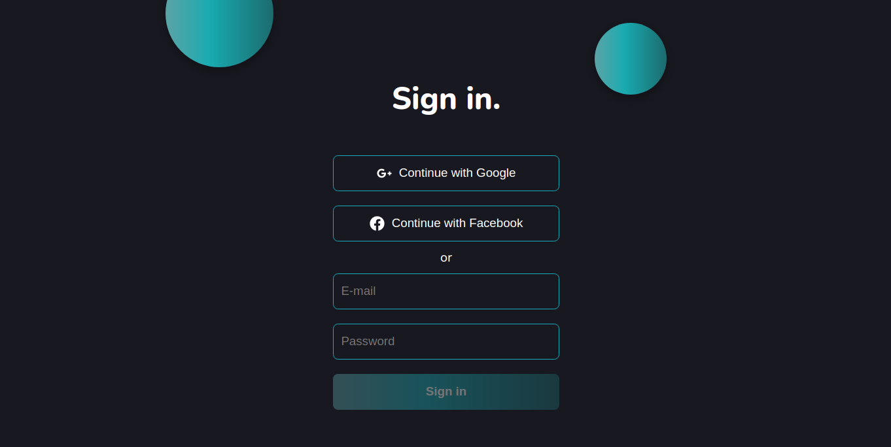
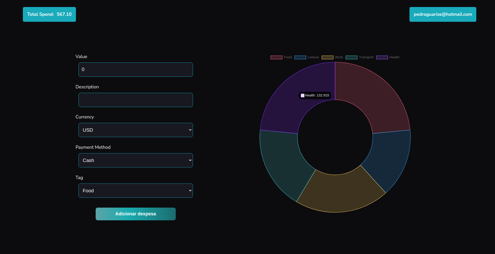

# Expenses Manager - Trybe

This is my solution to [Trybe's](https://www.betrybe.com/) Expenses Manager Project. Trybe is a web development school that has a genuine commitment to the professional success of it's students and where I started and first feel in love with web development.

## Table of contents

- [Expenses Manager - Trybe](#expenses-manager---trybe)
  - [Table of contents](#table-of-contents)
  - [Overview](#overview)
    - [The challenge](#the-challenge)
    - [Screenshot](#screenshot)
    - [Links](#links)
    - [Built with](#built-with)
  - [Author](#author)

## Overview

This was the first React project using Redux. The goal was to develop an expense control wallet with a currency converter.

### The challenge

Users should be able to:

- Add, remove and edit an expense;
- View a table with your expenses;
- View the total expenses converted to a currency of choice;

### Screenshot

### Links

- Live Site URL: [Expenses Manager App](https://trivia-game-drab.vercel.app/)

### Built with

- Flexbox
- Mobile-first workflow
- [React](https://reactjs.org/) - JS library
- [Redux](https://redux.js.org/) - JS library

## Author

- [Pedro Guarize](https://www.linkedin.com/in/pedroguarize/)
